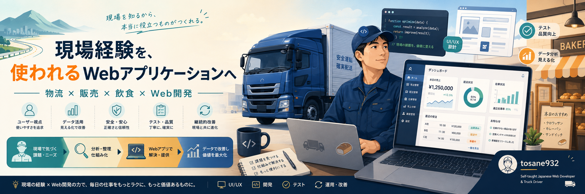

> **[Qiita](https://qiita.com/tosane932) / [Zenn](https://zenn.dev/tosane932) / [DEV Community](https://dev.to/tosane932) で、開発記録・エラー解決・検証結果を公開しています**

# 🛠️ 現場経験を、使われるWebアプリケーションへ

物流・飲食・販売の現場経験と、Webデザインで培った視線誘導・配色・情報設計の知識を組み合わせ、**利用者が迷わず操作でき、実際の業務改善につながるWebアプリケーション**の開発に取り組んでいます。

IT業界での実務経験はありませんが、2026年5月12日より、本業の大型・中型トラックドライバーを続けながら、Pythonを中心にRuby on Railsも用いたWebアプリケーション開発を独学しています。

学習開始以降、以下の開発・運用を経験しています。

- Python / Flaskを用いたWebアプリケーション開発
- PostgreSQL / SQLAlchemy / Alembicによるデータベース設計・変更管理
- Docker / Docker Composeによる開発環境構築
- pytest / GitHub Actionsによる自動テストとCI
- pytestを**3件から668件**まで、実装・事故・監査結果に応じて段階的に拡充
- 入力値検証・DB整合性・rollback・履歴保持・ダッシュボード集計・認証・CSRF・アクセス制御を回帰テスト化
- 空DBからAlembic headまで到達できることを自動検証するMigration回帰テスト
- `(product_id, date)`のDB一意制約追加と、隔離PostgreSQL環境でのupgrade / downgrade検証
- Flask-Loginによる単一管理者認証と、Flask-WTFによるCSRF保護
- 認証設定fingerprintを用いた既存Admin Sessionのfail-closed化
- 改ざんされたCSRF tokenが業務処理へ到達しないことを回帰テスト化
- 業務画面・APIを認証必須化し、匿名ユーザーからのAI API実行を防止
- 不正な`year`・`month` queryをHTTP 400で拒否する入力検証
- Gemini APIの429・503・想定外例外に対するfallbackをモックで回帰テスト
- Falsification（反証）の観点から既存pytestの検出力を再検証
- 代表的な11件の手動Mutation Testingを実施し、初回SURVIVEDした5件をテスト強化後に再検証
- 選択した11 MutationすべてをKILL可能な状態までpytestを強化
- Flask-SQLAlchemyの非推奨APIを整理し、pytest強化第5段階時点で**91 passed, 0 warnings**まで改善
- Guest Demo向けに`Dataset`モデルと`Product.dataset_id`を導入し、既存管理者データを安全に分離するMigrationを実装
- Admin専用境界、Guest identity、Dataset認可を段階的に追加
- Guest用Datasetをサーバー側で発行し、`guest:<UUID>`形式のGuest identityと結びつける仕組みを実装
- Product / DailySales / Dashboard / AI / seedをDataset単位にスコープし、Admin・Guest A・Guest B間の越境を回帰テスト化
- 外部から`dataset_id`やAdmin風Session値を差し込んでも権限昇格・対象Dataset変更ができないことを検証
- Guest Datasetへ**無操作30分・開始から最大2時間**の有効期限を導入
- 期限切れGuest DatasetとProduct / DailySales / MaterialOrderItem / ShopMemoを安全に削除するcleanupを実装
- cleanupと利用者操作の競合をPostgreSQLのrow lockを用いて検証
- Guest Dataset単位でGemini APIの利用を**合計3回まで**に制限
- Guest Session作成にIP由来HMAC keyを用いたrate limitを導入し、生IPをDBへ保存しない設計を実装
- PostgreSQL advisory lockを用いてGuest Dataset作成処理を直列化し、有効Guest Datasetを最大10件に制限
- CSRF保護された`POST /guest/start`を公開し、認証情報不要でGuest Demoを開始できる入口を実装
- Guest 1 Datasetあたりの商品数を最大30件、Product / Sales POSTを1回最大30件に制限
- AI APIをPOST + CSRF保護へ変更し、拒否されたrequestがGeminiへ到達しないことを検証
- GuestからGeminiへ渡す商品数・商品名・数量・promptサイズに上限を設定
- Adminログイン失敗を**5回 / 15分**に制限し、PostgreSQL上の並行requestによるrate limitすり抜けも検証
- Session CookieへSecure / HttpOnly / SameSite=Laxを設定
- `X-Content-Type-Options`、`Referrer-Policy`、`Permissions-Policy`、`X-Frame-Options`、限定CSPなどのSecurity Headersを追加
- `Strict-Transport-Security`を導入し、HSTSを回帰テスト化
- 月替わり・年替わりで日付依存pytestが壊れた事故を、再発防止テストとして記録
- Dashboardで売上データが存在する月を✅表示し、Dataset境界を保ったまま利用可能年月を可視化
- 日次売上入力時に現在値を選択状態にし、既存値を削除せずそのまま上書きしやすいUIへ改善
- Dataset単位の材料発注リストを実装し、100件上限・完了状態・削除・PostgreSQL並行requestを検証
- 店舗メモに作成・編集・検索・pin・複製・autosave・ゴミ箱・復元・完全削除・URL linkifyを実装
- スマートフォン向けに長押し・swipe・Undo・FAB・responsive editorを実装し、実機操作を改善
- アプリ全体の固定UIをinline SVGへ統一し、ベーカリー向けブランドを**Bakery Hub**へ整理
- GitHub Actionsで通常pytestとPostgreSQL 16 integrationを実行する二層CIを運用
- feature branch / Pull Request / GitHub Actionsを通した変更確認とmainへのMerge
- Gunicorn / Renderによる本番公開
- Gemini APIを利用したAI機能の実装
- Google OAuth / Flask-LoginによるOAuth認証機能の実装
- JavaScriptによるブラウザ完結型Webアプリケーション開発
- VS Code版Codexを用いた、事実と推測を分けたリポジトリ全体の静的レビュー
- Codexへ変更範囲・禁止事項・停止条件を段階ごとに指定し、小さな単位で修正・検証する運用
- `AGENTS.md`へGit・DB・Migration・Guest Demo・テスト・本番操作に関する安全ルールを明文化
- 開発過程・失敗・設計判断をQiita・Zenn・DEV Community・GitHubへ継続的に記録
- 現在の`sales_data_app`全体テスト結果：**668 passed, 16 skipped**

Webデザインでは、見た目を整えることだけでなく、**見る人の視線の流れ、情報の優先順位、ボタン配置、操作手順の分かりやすさ**を意識しています。

さらに、全国の百貨店催事で広島風お好み焼きの調理・実演販売、売上管理、材料発注、スタッフ管理を経験したことで、利用者がどこで迷い、どの言葉なら行動へ移りやすいかを、実際の販売現場から学びました。

現在は、次のコンセプトをアプリ開発の判断基準にしています。

> **老若男女、誰が見ても使いやすいアプリ**

- 曖昧な文言を避ける
- 現在の登録状態を画面に表示する
- 操作の種類ごとに色を統一する
- 色だけでなくアイコンと具体的な文言を併用する
- 次に行う操作へ迷わず移動できる導線を作る
- ヒューマンエラーを個人の注意力だけに頼らず、仕組みで防ぐ
- エラー発生後の対処だけでなく、起き得る事故をテストと設計で先回りして防ぐ

物流や飲食など、時間に追われる現場でも直感的に使える画面設計と、利用者が「これ、どうしたらいいですか？」と困る前に迷いの原因を取り除くシステム設計を目指しています。

開発環境には、13年前に購入し、現在も使い続けているLenovo G580を使用しています。処理速度と費用対効果を考え、自らSSD 256GBへの換装、メモリ16GBへの増設、OSの変更・検証を重ね、現在はLubuntu 24.04 LTS上で開発しています。

限られた機材やクラウド環境の制約を理由に止まるのではなく、原因を切り分け、代替案を検討し、**第三者が実際に触れられる「動く成果物」まで届けること**を重視しています。

---

## 📂 資格・現場経験

### 🎨 デザイン・情報処理関連資格

- **ウェブデザイン技能士 3級**
  - Web制作の基礎知識を、画面の視線誘導・情報設計・操作性の改善に活用
- **色彩検定 3級**
  - 配色、視認性、情報の強弱を意識したUI設計に活用
- **情報処理技能検定（表計算）1級**
  - 業務データの整理・集計・分析に関する基礎力
- **日本語ワープロ検定 準1級**
  - README、技術記事、操作説明などの文書作成に活用
- **MOS Excel 2007**
  - 表計算・データ管理・業務集計の基礎を習得

### 🚚 主な現場経験

- **百貨店・催事場での調理・実演販売**
  - 全国の百貨店催事にて、広島風お好み焼きの調理・実演販売、材料発注、売上管理、販売スタッフの採用・管理を経験
  - 自ら商品を作り、セールストークを考え、接客し、お客様へ販売する一連の商売を経験
  - 元お好み焼き職人として、調理・接客・在庫・売上・人員を同時に管理する現場運営に従事
  - お客様がどこで迷うか、どの言葉なら伝わるかという販売現場の感覚を、UIの文言・配色・画面導線へ活用

[「保存」と「更新」は違う。元お好み焼き職人が店長目線でFlaskアプリの迷うUIを潰した話](https://qiita.com/tosane932/items/245152c844261e615641)

- **自動販売機補充オペレーター**
  - 3年間、過去の売上データから巡回ルート、積載量、商品構成、販促施策を逆算して設計
  - 限られた時間と車両容量の中で、効率的な運用を組み立てる業務を経験

- **大型・中型トラックドライバー（現役）**
  - 大型免許を保有し、7年以上にわたり物流業務に従事
  - 厳しい時間制限と安全基準の中で、運行判断、確認作業、ヒューマンエラー防止を実践
  - 「危険が起きてから対応するのではなく、起きる可能性を予測して先に潰す」という危険予知を、アプリ開発にも応用

---

## 📅 開発の歩みとアウトプット履歴

既存コードをそのまま無批判に取り込むのではなく、現場での課題感に基づいて仕様を考え、AIの提案も目的・影響範囲・検証結果を確認しながら採用しています。

また、動作するコードを作るだけでなく、利用者がどのように受け取るか、誤操作や勘違いが起きないかまで検証し、定期的なコード・UI・READMEのリファクタリングを自身の「技術資産」として記録しています。

<details>
<summary><strong>📖 開発履歴を表示する</strong></summary>

<br>

| 日付 | マイルストーン・実装内容 | 学習開始から | 関連Qiita記事 |
| :--- | :--- | :--- | :--- |
| **2026/05/12** | Pythonを中心とした本格的なシステム開発学習を開始。自動化プログラムとWebアプリケーションの設計・実装に着手 | 開始日 | - |
| **2026/05/23** | GitHubによるソースコード管理環境を構築し、Python / Flaskを用いた初期3システムを公開。構想段階で実現性を検証し、車載ローカルサーバー案からWebアプリケーション開発へ方針転換 | 12日 | [車載ローカルサーバー構想を損切りし...](https://qiita.com/tosane932/items/37c9d2c482a6611d2f25) |
| **2026/06/02** | Ruby on Rails 8を用いたWebアプリケーションをRenderへ本番公開。無料クラウド環境のメモリ・ファイルシステム制約を調査し、ローカルプリコンパイルと永続ディスクによる代替案を検証 | 22日 | [Render無料枠の制限を回避したRails 8のデプロイ検証](https://qiita.com/tosane932/items/58e00fc7353ef76b4a62) |
| **2026/06/03** | Pythonで事前に外部データを取得・整形し、JSONファイルとして静的サイトへ供給する「データ出荷型」構成を実装 | 23日 | [Python学習開始24日目の記録...](https://qiita.com/tosane932/items/a227899ee58d68020c21) |
| **2026/06/18** | 過去のREADME・学習記録・技術記事を全面的に見直し、現象・原因・判断・結果を区別した事実ベースの技術ドキュメントへ再構成 | 38日 | [過去の学習記録を『リファクタリング』する...](https://qiita.com/tosane932/items/3d05208f519db621efef) |
| **2026/06/24** | `sales_data_app`のデータ保存先をSQLiteからPostgreSQLへ移行 | 44日 | - |
| **2026/06/28** | `sales_data_app`のコード全体を再点検し、重複処理・不要コード・例外処理不足など9件の問題を発見・修正 | 48日 | [学習100時間のトラックドライバーが...](https://qiita.com/tosane932/items/ac18b633c8c87b9807bb) |
| **2026/06/30** | `sales_data_app`をDocker化し、FlaskとPostgreSQLをまとめて起動できる再現可能な開発環境を構築 | 50日 | - |
| **2026/07/02** | Docker上のFlaskコンテナとPostgreSQLコンテナを連携し、名前解決・ボリューム・ローカルとの差異を検証 | 52日 | [FlaskとPostgreSQLのマルチコンテナ環境における...](https://qiita.com/tosane932/items/e19ed4a2ffe27f53faf0) |
| **2026/07/04** | `sales_data_app`をRenderへ本番デプロイ。環境変数・DB接続・起動処理の差異を切り分けて修正 | 54日 | [【実録】学習113時間のトラックドライバーが...](https://qiita.com/tosane932/items/31bdab8ee2ab8bae2c50) |
| **2026/07/06** | 全50問の運転性格診断アプリを開発。Fisher-Yates法と5段階傾斜配点を実装 | 56日 | [なぜ『運転性格診断クイズ』なのに...](https://qiita.com/tosane932/items/220d0f7d36bd79b2aa81) |
| **2026/07/09** | 運転性格診断アプリへrippleアニメーションと多重操作防止処理を追加 | 59日 | [🚽トイレの点滅ランプと"isProcessing"フラグが同じだった件](https://qiita.com/tosane932/items/33734f1e963fcb370318) |
| **2026/07/11** | Dockerfileをマルチステージビルド化し、イメージサイズを実測 | 61日 | [マルチステージビルドで積み替えても、3MBしか減らなかった話](https://qiita.com/tosane932/items/c1609f17cddf842f1e7c) |
| **2026/07/11** | pytestとGitHub Actionsを導入し、GitHubへのPush時に自動テストを実行するCI環境を構築 | 61日 | [トラックドライバーが「点検ゲート」を作ってみたら、テストの落とし穴にハマった話](https://qiita.com/tosane932/items/b9b6576c1fda3d3a76d2) |
| **2026/07/16** | `is_active`による論理削除、過去売上履歴保持、Alembic、Gemini APIのボタン実行化、Gunicorn本番起動を実装 | 66日 | [売上履歴を壊さず商品を販売終了にしたい――Flaskで論理削除とGemini API節約を実装した記録](https://qiita.com/tosane932/items/4825452f4bb73fd90ba8) |
| **2026/07/17** | `puoppo_app`へGoogle OAuthとFlask-Loginを導入 | 67日 | - |
| **2026/07/18** | CSSを`static/style.css`へ分離し、ページ別スコープを設定 | 68日 | [「保存」と「更新」は違う。元お好み焼き職人が店長目線でFlaskアプリの迷うUIを潰した話](https://qiita.com/tosane932/items/245152c844261e615641) |
| **2026/07/18** | 店長目線で文言・配色・未来年表示・登録状態・画面導線を改善 | 68日 | [「保存」と「更新」は違う。元お好み焼き職人が店長目線でFlaskアプリの迷うUIを潰した話](https://qiita.com/tosane932/items/245152c844261e615641) |
| **2026/07/19** | `sales_data_app`のリポジトリ全体を5時間総点検し、不要コード・画像資料・README・ignore設定などを整理 | 69日 | [🚛 動いているFlaskアプリを5時間総点検...](https://qiita.com/tosane932/items/02de476fad8f0c1261e0) |
| **2026/08/02** | VS Code版Codexで静的レビューを実施。18件の改善候補を抽出し、動的ランキングの保存型XSSを修正 | 83日 | [🔨47秒でXSS修正！？...](https://qiita.com/tosane932/items/95f998ff98c4ac2ec5d9) |
| **2026/08/06** | 欠落していた初期マイグレーションを修復し、空DB構築と既存DB複製環境の両経路を検証 | 87日 | [Flask-Migrate導入後の空DBで...](https://qiita.com/tosane932/items/13c2ca0e17716594aa1e) |
| **2026/08/10** | pytest強化を第2段階まで実施。3件→9件→51件へ拡充し、売上POST・商品POST・DB一意制約・rollback・履歴保持・dashboard APIを回帰テスト化 | 91日 | [pytestを「事故防止台帳」として育てる 第2段階](https://qiita.com/tosane932/items/b91261e7103df5792f7d) |
| **2026/08/11** | pytest強化第3段階を完了。単一管理者認証、CSRF保護、業務画面・APIのアクセス制御を実装し、51件→69件へ拡充 | 92日 | [pytestを「事故防止台帳」として育てる 第3段階](https://qiita.com/tosane932/items/6d1ca5490979c8cf9d62) |
| **2026/08/13** | pytest強化第4段階を完了。空DB Migration、不正query、Geminiエラーfallback、認証Session、改ざんCSRFを強化し、69件→87件へ拡充 | 94日 | [pytestを「事故防止台帳」として育てる 第4段階](https://qiita.com/tosane932/items/372270330e73583a227f) |
| **2026/08/15** | pytest強化第5段階を完了。Falsificationと手動Mutation Testingで既存pytestの検出力を検証。87件→91件へ拡充 | 96日 | [pytestを「事故防止台帳」として育てる 第5段階](https://qiita.com/tosane932/items/85fd24c7baa6fe7c76a7) |
| **2026/08/15** | Flask-SQLAlchemyのDeprecationWarningを修正し、91 passed・0 warningsへ改善 | 96日 | - |
| **2026/08/19** | Guest Demo第1段階を完了。`Dataset`と`Product.dataset_id`を追加し、既存ProductをAdmin Datasetへbackfill。pytestを114件へ拡充 | 100日 | [第1段階：既存AdminデータをDatasetへ移行](https://qiita.com/tosane932/items/2ccaab5c1b7e29619345) |
| **2026/08/21** | Guest Demo第2段階①を完了。Admin専用境界、`GuestUser`、`guest:<UUID>` identity、`require_current_dataset()`を追加。pytest169件 | 102日 | [第2段階①：Admin境界・Guest identity・Dataset認可](https://qiita.com/tosane932/items/77cc200ab78761174b91) |
| **2026/08/22** | Guest Demo第2段階②を完了。Guest Datasetをサーバー側で発行しGuest identityと結合。pytest181件 | 103日 | [第2段階②：Guest Dataset発行・181件GREEN再監査](https://qiita.com/tosane932/items/aa3b8a06029e8d5e3f25) |
| **2026/08/23** | Guest Demo第3段階を完了。Product / DailySales / Dashboard / API / AI / seedをDataset単位にスコープし、181件→195件へ拡充 | 104日 | [第3段階：Dataset越境を潰し181→195件](https://qiita.com/tosane932/items/f825aff19bff0d3d122c) |
| **2026/08/24** | Guest Demo第4段階を完了。正規Guestを実業務routeへ通しつつDataset境界を維持。195件→201件、Pull Request #6をmainへMerge | 105日 | [第4段階：正規Guestを実routeへ通し195→201件](https://qiita.com/tosane932/items/166113162b6a4d1a437e) |
| **2026/09/02** | 9月への月替わりで固定年月のpytestがREDになった事故を修正。さらに月替わり・年替わり回帰テストを追加し203件へ拡充 | 114日 | - |
| **2026/09/03** | Guest Demo第5段階として、無操作30分・絶対2時間の期限判定、`last_activity_at`更新、期限切れDataset cleanupを実装。222 passed | 115日 | - |
| **2026/09/03** | Guest Dataset単位でAI advice / greeting合計3回までの利用制限を追加。DB側の条件付きUPDATEでatomicに利用権を確保。244 passed | 115日 | - |
| **2026/09/05** | Guest Session作成rate limitを追加。IPを検証・正規化後、HMAC-SHA256済みkeyだけをDBへ保存。266 passed | 117日 | - |
| **2026/09/05** | `AGENTS.md`を追加し、Git履歴・本番DB・Migration・Render・Gemini・pytestなどの安全運用ルールをリポジトリへ明文化 | 117日 | - |
| **2026/09/06** | cleanup候補選定後にGuestが再活動した場合のrace conditionを発見。row lock取得後に期限を再判定する方式へ修正し、PostgreSQL実並行テストでも検証。267 passed | 118日 | - |
| **2026/09/06** | 日次売上入力欄へフォーカスした際、既存数量を選択状態にするUIを追加。30→35のような上書き操作を容易に改善 | 118日 | - |
| **2026/09/06** | Dashboardの月選択肢へ、現在のDatasetでDailySalesが存在する月だけ✅を表示する仕組みを追加。269 passed | 118日 | - |
| **2026/09/07** | PostgreSQL advisory lockを用いてGuest Dataset作成を直列化し、同時に存在できる有効Guest Datasetを最大10件へ制限。291 passed | 119日 | - |
| **2026/09/07** | `/login`へGuest Demo公開入口を追加。CSRF保護された`POST /guest/start`と利用状況表示を実装し、Guest Demoを一般公開。310 passed | 119日 | - |
| **2026/09/08** | Guestの1 Datasetあたりの商品総数を30件へ制限し、Product / Sales POSTも1回30件までに制限。PostgreSQL並行POSTも検証。336 passed | 120日 | - |
| **2026/09/09** | AI APIをPOST + CSRF保護へ変更。Guest promptへ商品数・文字数・数量上限を追加し、例外詳細をログへ出さないよう強化。362 passed | 121日 | - |
| **2026/09/09** | Gemini APIの既定モデル設定を更新し、Admin / Guest双方から実APIの200応答を確認 | 121日 | - |
| **2026/09/09** | Adminログイン失敗5回 / 15分のrate limitを追加。PostgreSQL advisory lockで並行ログインによる上限すり抜けを防止。373 passed, 4 skipped | 121日 | - |
| **2026/09/09** | Session CookieをSecure / HttpOnly / SameSite=Laxへ強化し、Security Headers・`Cache-Control: no-store`を追加 | 121日 | - |
| **2026/09/09** | `Strict-Transport-Security: max-age=86400`を追加し、初期HSTSを回帰テスト化。**378 passed, 4 skipped** | 121日 | - |
| **2026/09/11** | 全pytestを`tests/`配下へ整理し、テストパスを統一。**381 passed, 4 skipped** | 123日 | - |
| **2026/09/13** | Dataset単位の材料発注リストを実装。追加・完了 / 未完了・削除・100件上限とPostgreSQL上の並行制御を追加。**478 passed** | 125日 | - |
| **2026/09/14** | 店舗メモのデータ基盤とCRUD・検索を実装。`ShopMemo`、soft delete、Dataset分離、100件上限を追加。**583 passed, 14 skipped** | 126日 | - |
| **2026/09/15** | 店舗メモへTrash / restore / permanent deleteと安全なURL自動リンクを追加。PostgreSQL統合テストを拡張。**590 passed, 16 skipped** | 127日 | - |
| **2026/09/20** | 店舗メモへtitle・pin・autosave・複製・Undo・スマートフォン向けgestureを統合。**646 passed, 16 skipped** | 132日 | - |
| **2026/09/22** | 店舗ツールのMobile UI/UX、共通SVG Navigation、カテゴリカラーを整理し、ベーカリー向けブランドを**Bakery Hub**へ統一。PR #42時点で**668 passed, 16 skipped** | 134日 | - |

</details>

---

## ⚡ 開発実績・リポジトリ一覧

### 1. [🍞 sales_data_app / Bakery Hub](https://github.com/tosane932/sales_data_app)

【Python / Flask / PostgreSQL / Docker / Gemini API】

- **公開環境**: [Bakery Hubを開く](https://bakery-salesdata.onrender.com/)
- **概要**: 商品マスタ、日次売上入力、売上分析、Geminiによる経営アドバイスに加え、材料発注リスト・店舗メモを一元化したベーカリー向け業務支援Webアプリケーション
- **コンセプト**: 元お好み焼き職人としての店舗運営経験とWebデザインの知識を生かし、忙しい現場でも老若男女が迷わず使える業務システムを設計
- **Guest Demo**: 認証情報不要で公開中。Guestごとに専用Datasetを発行し、Admin・他Guestから分離した状態で商品登録・日次売上入力・Dashboard・材料発注・店舗メモ・Gemini APIを実際に操作可能
- **Guest期限**: 無操作30分 / 開始から最大2時間
- **Guest AI**: 1 DatasetにつきAI advice / greeting合計3回まで
- **Guest商品上限**: 1 Dataset最大30商品
- **同時Guest上限**: 有効Guest Dataset最大10件
- **店舗メモツール**: 材料発注・店舗メモを実装。タスクはmainでは準備中
- **現在のテスト結果**: **668 passed, 16 skipped**
- **CI**: GitHub Actionsで通常pytest + PostgreSQL 16 integrationの二層構成

### 主な設計・実装

- SQLiteからPostgreSQLへの移行
- SQLAlchemyによるデータ管理
- `is_active`を用いた論理削除と過去データの保持
- Flask-Migrate / AlembicによるDBマイグレーション
- Docker / Docker Composeによる環境構築
- Gunicorn / Renderによる本番公開
- pytest / GitHub Actionsによる自動テスト
- pytestを**3件から668件**まで段階的に拡充
- 空DBからAlembic headまで到達できるMigration回帰テスト
- Flask-Loginによる単一管理者認証
- Flask-WTFによるCSRF保護
- 認証設定fingerprintによる既存Admin Sessionのfail-closed化
- 改ざんCSRF tokenの拒否と副作用防止テスト
- 匿名ユーザーによるAI API実行の防止
- 不正な年月queryのHTTP 400処理
- Gemini APIの429・503・想定外例外のfallbackテスト
- Falsificationによる既存pytestの検出力検証
- 代表的な11件の手動Mutation Testing
- `Dataset`モデルによるAdmin / Guestデータ領域の分離
- `Product.dataset_id`の導入と既存データbackfill、NOT NULL化
- `admin_required`によるAdmin専用境界
- `guest:<UUID>`形式のGuest identity
- Guest identity / sessionの発行・復元とfail-closedな認可
- `require_current_dataset()`による認証主体ごとのDataset解決
- Guest Datasetのサーバー側発行
- Product / DailySales / MaterialOrderItem / ShopMemo / Dashboard / AI / seedのDatasetスコープ
- Guest A / Guest B間の商品・売上・材料発注・店舗メモ・Dashboard・AIデータ越境防止
- 越境POST失敗時にDB副作用を残さない原子性の回帰テスト
- Sessionへrole・is_admin・dataset_id相当の値を差し込んでもAdminへ昇格できないことを検証
- 正規Admin / Guestのみを通す`admin_or_guest_required`を業務routeへ適用
- Guest Datasetの無操作30分・絶対2時間の期限管理
- Guest利用時の`last_activity_at`更新
- 期限切れGuest Datasetの機会的cleanup
- `MaterialOrderItem / ShopMemo → DailySales → Product → Dataset`の明示的削除
- cleanup失敗時のrollback
- cleanupとGuest活動の競合をrow lock取得後の再判定で防止
- PostgreSQL上でcleanupと利用者操作・複数cleanupの並行動作を検証
- Guest Dataset単位のAI合計3回制限
- DB側の条件付きUPDATEによるatomicなAI利用権確保
- Guest Session作成rate limit
- 生IPを保存しないHMAC-SHA256 client key
- PostgreSQL advisory lockによるGuest作成処理の直列化
- 有効Guest Dataset最大10件
- CSRF保護された`POST /guest/start`
- Guest capacity表示
- Guest 1 Dataset最大30商品
- Guest Product / Sales POST最大30件
- 商品名・価格・数量・年月のサーバー側上限
- AI APIのPOST化とCSRF保護
- Guest AI promptの商品数・文字数・数量上限
- Adminログイン失敗5回 / 15分のrate limit
- PostgreSQL上の並行ログインrace condition検証
- Session Cookie Secure / HttpOnly / SameSite=Lax
- `X-Content-Type-Options: nosniff`
- `Referrer-Policy: strict-origin-when-cross-origin`
- `Permissions-Policy`
- `X-Frame-Options: DENY`
- 限定Content Security Policy
- `Cache-Control: no-store`
- `Strict-Transport-Security`
- feature branch / Pull Request / GitHub Actionsを用いた変更確認フロー
- VS Code版Codexによる静的レビュー
- `AGENTS.md`によるAI開発時の安全ルール明文化
- 保存型XSS対策
- HTML sink混入を検知するXSS回帰テスト
- Jinja2 autoescapeの初期表示経路を確認する回帰テスト
- UI文言・配色・導線の改善
- 日次売上入力時の既存値自動選択
- Dashboardで売上データが存在する月を✅表示
- 材料発注リストのCRUD・完了状態・100件上限・PostgreSQL並行制御
- 店舗メモのCRUD・検索・pin・複製・autosave・Trash / restore / permanent delete
- 店舗メモ本文のHTTP / HTTPS絶対URLだけを安全にlinkifyし、DBにはplain textを保存
- スマートフォン向け長押し・swipe・Undo・FAB・responsive editor
- Bakery Hubブランド、inline SVG、カテゴリカラーによる共通Navigation
- 月替わり・年替わり事故の回帰テスト
- GitHub Actionsの通常pytest + PostgreSQL 16 integration
- 最新テスト結果：**668 passed, 16 skipped**

<details>
<summary><strong>🔧 sales_data_app の詳細な実装・検証内容を表示する</strong></summary>

<br>

### Database / Migration

- 欠落していた初期テーブル作成履歴を調査し、`products`と`daily_sales`を作成する基礎revisionを追加
- 既存の`is_active`追加revisionを基礎revisionへ接続し、空DBからheadまで到達できる履歴へ修復
- `DailySales(product_id, date)`へ一意制約を追加し、同一商品・同一日の重複をDB側でも拒否
- 通常環境とは異なるComposeプロジェクト名を使用し、コンテナ・ネットワーク・PostgreSQLボリュームを分離
- 空PostgreSQLから`flask db upgrade`、Gunicorn起動、HTTP 200を確認
- 既存DBを読み取り専用で`pg_dump`し、分離した複製DBへ復元してupgrade経路を検証
- 一意制約追加migrationを隔離PostgreSQL環境でupgrade / downgrade / 再upgradeし、既存データが変化しないことを確認
- 一時SQLite DBを利用し、Alembic baseからheadまでupgradeできることをpytestで自動検証
- 最終schema、必要table・column、Alembic revision、複合一意制約を回帰テスト化
- Guest Demo向けに`datasets`テーブルを追加し、Admin Datasetを作成
- `products.dataset_id`をNULL可で追加した後、既存ProductをAdmin Datasetへbackfill
- Product / DailySalesの件数・ID、NULL / orphanの有無を検証してから`products.dataset_id`をNOT NULL化
- Dataset → Productの1:N、外部キー、INDEX、`ON DELETE CASCADE`を追加
- Guest Datasetが存在する状態では危険なdowngradeを拒否するMigration guardを実装
- `guest_ai_usage_count`をDatasetへ追加し、Adminは0固定、Guestは0〜3のDB制約で保護
- `guest_creation_rate_limits`テーブルを追加し、匿名化したclient key単位でGuest作成回数を管理
- Product / DailySalesを壊さずGuest用schemaを段階的に追加できることをMigrationテストで検証

### Validation / Transaction

- 売上POSTの日付・数量・配列長・商品IDをDB変更前に全件検証
- 不正な売上リクエストをHTTP 400で拒否
- 売上対象商品の存在・対象年月・販売状態を検証
- 商品POSTの配列長・商品ID・対象年月・重複ID・価格・年月を事前検証
- 不正入力時にProduct / DailySalesが変更されないことを確認
- 売上POST・商品POSTの`commit()`失敗時に`rollback()`
- 同じ商品の別日売上が存在しても、対象日以外を誤更新しないことを回帰テスト化
- 論理削除後もProduct IDと過去DailySalesを保持
- 既存Product ID再送信時に同じ行を再有効化する挙動をテスト化
- `/api/dashboard-data`で年月別集計・ランキング・グラフ値・inactive商品の過去履歴・全期間集計を検証
- Guest AからGuest Bの商品IDを混ぜたPOSTを全体拒否し、一部だけ保存されないことを確認
- Guest AからGuest Bへの売上入力を拒否し、越境失敗時にDB副作用を残さないことを確認
- Guest Product / Sales POSTを1回最大30件に制限
- Guest 1 Datasetの生涯Product数を最大30件に制限
- 論理削除済み商品も上限判定へ含め、削除と再作成による上限回避を防止
- Dataset rowをlockし、同時Product POSTでも30商品上限を超えないことをPostgreSQLで検証
- 商品名・価格・数量・年月にサーバー側上限を設定

### Authentication / CSRF / Access Control

- Flask-Loginを利用した単一管理者ログインを実装
- `SECRET_KEY`、`ADMIN_USERNAME`、`ADMIN_PASSWORD_HASH`を環境変数から取得
- Werkzeugの`check_password_hash()`を利用してpassword hashを検証
- Flask-WTFの`CSRFProtect`をアプリ全体へ適用
- `/login`、`/`、`/input`のPOSTフォームへCSRF tokenを追加
- テスト環境でもCSRFを無効化せず、実際にtokenを取得してPOSTするfixtureを実装
- 管理者password hashから認証設定fingerprintを生成し、Sessionへ保存
- password hash変更後の既存Admin Sessionをfail-closedで拒否
- fingerprint欠落Admin Sessionも認証済みとして扱わないことを回帰テスト化
- 認証設定が変わっていない既存Admin Sessionは正常復元
- login・商品・売上POSTに対して改ざんCSRF tokenをテスト
- CSRF拒否時に認証SessionやDB変更などの副作用が発生しないことを確認
- `admin_required`によりGuestからAdmin専用routeへのアクセスを拒否
- Guest用identityを`guest:{uuid}`形式で分離し、Admin IDとGuest IDを相互復元しないことを確認
- GuestUserは対応する`Dataset(kind="guest", system_key=None)`が存在する場合のみ復元
- Guest Dataset削除済み・非guest Dataset・DBエラー時はfail-closed
- Guest Datasetをサーバー側で新規発行し、そのDataset専用のGuest identityを発行
- Guest Dataset作成失敗時はGuestとしてログインさせない
- `admin_or_guest_required`により、正規AdminUser / GuestUser以外の認証済みprincipalを403で拒否
- `/`、`/input`、`/dashboard`、`/api/dashboard-data`、`/api/ai-advice`、`/api/greeting`をAdmin / Guestの両方からDataset境界内で利用可能
- `require_current_dataset()`でAdminはAdmin Dataset、Guestは自身のGuest Datasetだけを解決
- SessionへAdmin風のrole・flag・dataset_idを差し込んでもGuestからAdmin Datasetへ昇格できないことを回帰テスト化
- `/api/ai-advice`と`/api/greeting`をPOST化しCSRF保護
- CSRF拒否時にGemini Clientへ到達しないことを確認
- CSRF拒否時にGuest AI利用回数も消費しない
- Adminログイン失敗を同一clientあたり5回 / 15分に制限
- 6回目以降はHTTP 429
- 上限到達中は正しい資格情報でも認証処理へ進まない
- wrong username / wrong passwordで外部レスポンスを統一
- Guest作成rate limitとは別HMAC domain / 別counterを使用
- PostgreSQL advisory lockにより、並行requestでログイン上限をすり抜けないことをintegration testで検証

### Guest Demo / Dataset Isolation

- Product一覧・更新・論理削除を現在のDatasetへ限定
- DailySales取得・入力をProduct経由で現在のDatasetへ限定
- Dashboard HTML / APIの集計を現在のDatasetへ限定
- Dataset間に同名商品が存在しても売上を合算しないことを確認
- Geminiへ渡す売上データ・プロンプトへ他Datasetの情報を混入させないことを確認
- seedの存在判定をAdmin Dataset内だけで行い、Guestデータを変更しないことを確認
- Guest A / Guest Bの商品表示を分離
- Guest AからGuest Bの商品更新・売上入力を拒否
- 外部から`dataset_id`相当の値を与えても対象Datasetを変更できないことを確認
- Guest Datasetへ開始から最大2時間の絶対期限を設定
- Guest Datasetへ無操作30分の期限を設定
- 利用時に`last_activity_at`を更新
- identity復元時とDataset解決時の両方で期限を確認
- 期限切れGuest DatasetをGuest開始時にcleanup
- cleanup対象を`kind="guest"`かつ`system_key IS NULL`へ限定
- `MaterialOrderItem / ShopMemo → DailySales → Product → Dataset`の順序で削除
- cleanup途中のDB障害時はtransaction全体をrollback
- cleanupの冪等性をテスト
- cleanup候補取得後にGuestが再活動したrace conditionを再現
- row lock取得後にDBから最新状態を再取得し、期限判定をやり直すことで誤削除を防止
- PostgreSQLで「利用者更新が先」「cleanupが先」「cleanup同士が競合」「途中失敗」の並行ケースを検証
- Guest AI advice / greetingをDataset単位で合計3回までに制限
- 4回目以降は429を返しGemini APIを呼び出さない
- Gemini APIエラー時も、既に確保した利用回数は戻さない
- Gemini APIを呼び出さないfallbackでは利用回数を消費しない
- Guest Session作成rate limitをDBでatomicに管理
- `CF-Connecting-IP`を検証・正規化した後、HMAC-SHA256 keyへ変換
- 生IPやclient情報をDBへ保存しない
- Cookie削除や新Session作成でもGuest作成rate limitを回避できないことを確認
- Guest作成時のcleanup → 有効Guest COUNT → INSERTをPostgreSQL advisory lockで直列化
- 同時に存在できる有効Guest Datasetを最大10件へ制限
- `/login`からGuest Demoを開始可能
- `POST /guest/start`をCSRF保護
- Guest capacityをログイン画面へ表示
- Guest 1 Dataset最大30商品
- Product / Sales POST最大30件
- 現在のGuest DemoをRender上で公開

### Dashboard / Gemini API

- `year`・`month`が整数として解釈できない場合はHTTP 400で拒否
- 不正なAI advice queryではGemini Clientへ到達しないことを確認
- Gemini APIの429・503・想定外例外に対するfallbackメッセージをモックで回帰テスト
- 認証済み`/api/ai-advice`のroute単位正常系を検証
- 指定年月の売上だけがGeminiへ渡されることを確認
- 前年同月データをfixtureへ追加し、月だけではなく年条件も正しく作用していることを回帰テスト化
- Guest利用時も現在のGuest Dataset内の売上だけがAI処理へ渡されることを検証
- AI advice / greetingをPOST化
- Guest adviceはcurrent Dataset内で集計した上位30商品までに制限
- Dataset絞り込み後に集計・sort・LIMITを適用
- 商品名100文字、合計数量9,300,000個までを送信前に再検証
- Guest promptのサイズを制限
- Gemini例外本文・stack traceをアプリログへ直接出さない
- DashboardでDailySalesが存在する月を✅表示
- 月の存在判定も現在のDatasetへ限定
- inactive商品の過去売上もDashboard上の利用可能月判定へ含める
- 表示年月変更後に`🔍 データを抽出`する操作を画面上で明示

### Security Headers / Session

- 本番Session CookieをSecure化
- HttpOnlyを明示
- SameSite=Laxを明示
- ローカルHTTP開発時は環境設定でSecure Cookieを切り替え
- `X-Content-Type-Options: nosniff`
- `Referrer-Policy: strict-origin-when-cross-origin`
- `Permissions-Policy: camera=(), microphone=(), geolocation=()`
- `X-Frame-Options: DENY`
- CSPで`frame-ancestors 'none'`
- CSPで`base-uri 'self'`
- CSPで`object-src 'none'`
- CSPで`form-action 'self'`
- dynamic HTML / JSON APIへ`Cache-Control: no-store`
- `Strict-Transport-Security: max-age=86400`
- Security Header期待値をpytestで回帰テスト化

### XSS

- 動的ランキング表示の`innerHTML`を廃止し、DOM APIと`textContent`へ変更
- AI返答表示の`innerHTML`を`innerText`へ変更
- XSS回帰テストでHTML風文字列が要素として解釈されないことを確認
- `innerHTML`・`outerHTML`・`insertAdjacentHTML`などのHTML sinkが商品名表示へ混入した場合に検知するsource guardを追加
- Jinja2による初期ランキング表示でもautoescapeが維持されることを実データを使って確認

### pytest強化

```text
開始時
3 passed

第1段階
9 passed

第2段階
51 passed

第3段階
69 passed

第4段階
87 passed

第5段階
91 passed

Warning修正後
91 passed, 0 warnings

Guest Demo 第1段階
114 passed

Guest Demo 第2段階①
169 passed

Guest Demo 第2段階②
181 passed

Guest Demo 第3段階
195 passed

Guest Demo 第4段階
201 passed

月替わり・年替わり回帰
203 passed

Guest lifecycle / cleanup
222 passed

Guest AI利用制限
244 passed

Guest作成rate limit
266 passed

cleanup race修正
267 passed

日次売上UI改善
268 passed

Dashboard売上月表示
269 passed

有効Guest上限
291 passed, 1 skipped

Guest Demo公開入口
310 passed, 1 skipped

Guest商品・POST上限
336 passed, 2 skipped

AI公開前防御
362 passed, 2 skipped

Admin login rate limit
373 passed, 4 skipped

Security Headers / HSTS
378 passed, 4 skipped

tests/配下へ整理
381 passed, 4 skipped

材料発注リスト
478 passed

店舗メモCRUD・検索
583 passed, 14 skipped

Trash / URL linkify
590 passed, 16 skipped

店舗メモ新UI基盤
646 passed, 16 skipped

Mobile UI / Bakery Hub
668 passed, 16 skipped
```

現在の16件のskipは、主に専用PostgreSQL URLが必要なintegration testです。

GitHub Actionsでは通常pytestに加えてPostgreSQL 16のintegration jobを実行し、実DBが必要な並行処理・Migration・Dataset分離も継続して検証しています。

pytest強化第5段階では、単にテスト件数を増やすのではなく、

> **現在のGREENが、本当に重要な仕様違反を検知できるのか**

をFalsification（反証）の視点から検証しました。

代表的な11 Mutationを手動で適用した結果、

```text
初回KILLED
6件

初回SURVIVED
5件
```

となりました。

SURVIVEDした5件について、

- fixture不足
- assertion不足
- 異常Session状態の再現不足
- XSSの表示経路不足

などを分析し、pytestを強化しました。

その後、同一Mutationを再適用し、

```text
選択した11 Mutation
↓
すべてREDを確認
```

しています。

その考え方はGuest Demo実装後も継続しており、cleanupのrace conditionやAdmin login rate limitに加え、材料発注・店舗メモの件数上限やDataset分離についても、実際に壊れる状態を想定してSQLite / PostgreSQLの両方で回帰テスト化しています。

### Development Flow

- `feature/auth-hardening`で認証・CSRF・アクセス制御を段階的に実装
- Pull Request #1とGitHub Actionsを通して69件GREEN後にmainへMerge
- `feature/pytest-stage4`で第4段階を実施し、Pull Request #2を通して87件GREEN後にmainへMerge
- `feature/pytest-stage5`で第5段階を実施し、Pull Request #3を通して91件GREEN後にmainへMerge
- `fix/flask-sqlalchemy-warning`でWarningを修正し、Pull Request #4を通して91 passed・0 warnings
- `feature/guest-demo-mode`でDataset基盤とMigrationを実装し、Pull Request #5を通して114件GREEN
- Guest Demo第2段階①でAdmin専用境界・Guest identity・Dataset認可を追加し169件GREEN
- Guest Demo第2段階②でGuest Dataset発行を追加し181件GREEN
- Guest Demo第3段階でProduct / DailySales / Dashboard / AI / seedのDataset境界を強化し195件GREEN
- `feature/guest-demo-stage4`をPull Request #6で統合し201件GREEN
- Pull Request #7で月替わりに壊れた日付依存テストを修正
- Pull Request #8で月替わり・年替わり回帰テストを追加
- Pull Request #9でGuest期限・活動時刻・cleanupを統合
- Pull Request #10でGuest Dataset単位のAI3回制限を追加
- Pull Request #11でGuest Session作成rate limitを追加
- Pull Request #12で`AGENTS.md`によるリポジトリ安全ルールを追加
- Pull Request #13でcleanupのstale candidate race conditionを修正
- Pull Request #14で日次売上入力欄の既存値選択UIを追加
- Pull Request #15でDashboardへ売上データ存在月の✅表示を追加
- Pull Request #16で有効Guest Dataset最大10件とPostgreSQL advisory lockを追加
- Pull Request #17で公開Guest Demo入口を追加
- Pull Request #18でGuestの商品数・POST件数・入力値上限を追加
- Pull Request #19でAI APIをPOST + CSRF化しGuest prompt上限を追加
- Pull Request #20でGeminiモデル設定を更新
- Pull Request #21でAdmin login rate limitと並行request対策を追加
- Pull Request #22でSession Cookie / Security Headersを強化
- Pull Request #23で初期HSTSを追加
- Pull Request #25で全testファイルを`tests/`配下へ整理
- Pull Request #26〜#27で材料発注のデータ基盤・CRUD・PostgreSQL並行制御を追加
- Pull Request #28で共通Navigationと店舗メモツールのapp shellを追加
- Pull Request #29〜#32で店舗メモのDB基盤・CRUD・検索・Trash / restore / permanent delete・URL linkifyを追加
- Pull Request #34〜#35でtitle・pin・autosave・複製・Undo・スマートフォン向けeditorを統合
- Pull Request #37〜#41で店舗ツールのMobile UI/UX・microinteraction・SVG Navigationを改善
- Pull Request #42で固定UIのSVG・カテゴリカラー・Bakery Hubブランドを統合し668 passed / 16 skipped
- HTML内のCSSを`static/style.css`へ分離
- ページ専用クラスによるCSSの影響範囲制御
- スマートフォン向けレスポンシブデザイン
- `.gitignore`・`.dockerignore`による機密情報・ローカルデータ・開発資料の除外
- ローカル環境とRender公開環境の別DBで、商品登録・売上入力・ランキング・グラフ表示を実機確認

</details>

### ユーザー視点によるUI改善

- 不要な未来年の選択肢を削除
- 「保存する」を「本日の売上個数を更新する」へ変更
- 商品ごとに「本日の登録済み個数」を表示
- 入力欄へデータベースの現在値を初期表示
- 日次売上入力欄へフォーカスした際、現在値を選択状態にして上書きを容易に変更
- DashboardでDailySalesが存在する月へ✅を表示
- 表示期間変更後に`🔍 データを抽出`する必要があることを画面上へ明示
- 商品ごとの余白と区切り線を追加
- トップ・日次入力・売上分析間の画面導線を改善
- 商品登録・日次入力・売上分析・AI・戻る操作の配色を統一
- 色だけでなく、アイコンと具体的な文言を併用
- Guest Demoの利用状況と利用上限を画面上で明示
- Guest満員時はボタンをdisabled化し、実行できない状態を視覚的にも表示
- 材料発注・店舗メモを「店舗メモツール」として共通Navigationへ統合
- 店舗メモをスマートフォンで長押し・swipe・Undoできる操作へ改善
- virtual keyboard表示時も編集しやすいresponsive editorへ調整
- 固定UIの絵文字をinline SVGへ統一し、カテゴリごとの色と操作表現を整理
- Bakery Hubブランドへ統一し、売上管理と店舗業務ツールを一つの導線へ整理

### 公開記事

- [「🚛学習100時間のトラックドライバーが、自分のFlaskコードの積載ミスを9つ発見して全部直した話📦」](https://qiita.com/tosane932/items/ac18b633c8c87b9807bb)
- [「マルチステージビルドで積み替えても、3MBしか減らなかった話」](https://qiita.com/tosane932/items/c1609f17cddf842f1e7c)
- [「トラックドライバーが『点検ゲート』を作ってみたら、テストの落とし穴にハマった話」](https://qiita.com/tosane932/items/b9b6576c1fda3d3a76d2)
- [「🔨47秒でXSS修正！？VS Code版Codexを『他部署から来たベテラン点検員』として使ってみた」](https://qiita.com/tosane932/items/95f998ff98c4ac2ec5d9)
- [Flask-Migrate導入後の空DBで「テーブルが存在しない」と失敗した原因と、初期マイグレーションを修復した記録](https://qiita.com/tosane932/items/13c2ca0e17716594aa1e)

#### 👤 ゲストデモモード搭載シリーズ

- [第1段階：既存AdminデータをDatasetへ移行し、Guest領域を作る前の土台を整備](https://qiita.com/tosane932/items/2ccaab5c1b7e29619345)
- [第2段階①：Admin専用境界・Guest identity・Dataset認可の土台を構築](https://qiita.com/tosane932/items/77cc200ab78761174b91)
- [第2段階②：Guest用Datasetをサーバー側で発行し、pytest 169→181件で安全条件を再監査](https://qiita.com/tosane932/items/aa3b8a06029e8d5e3f25)
- [第3段階：Product・DailySales・Dashboard・API・AI・seedのDataset境界を強化し、181→195件](https://qiita.com/tosane932/items/f825aff19bff0d3d122c)
- [第4段階：正規Guestを実業務routeへ通し、Dataset越境を実request経路で検証。195→201件](https://qiita.com/tosane932/items/166113162b6a4d1a437e)

#### 📝 pytest「事故防止台帳」強化シリーズ

- [第1段階：3件の簡単なテストを9件の回帰テストへ強化](https://qiita.com/tosane932/items/f3de1e190873a90de39f)
- [第2段階：売上・商品登録まわりを51件まで強化](https://qiita.com/tosane932/items/b91261e7103df5792f7d)
- [第3段階：51件から69件へ、認証・CSRF・アクセス制御を強化](https://qiita.com/tosane932/items/6d1ca5490979c8cf9d62)
- [第4段階：69件から87件へ、Migration・API・認証・CSRFを強化](https://qiita.com/tosane932/items/372270330e73583a227f)
- [第5段階：Falsificationと手動Mutation Testingでpytestの検出力を検証](https://qiita.com/tosane932/items/85fd24c7baa6fe7c76a7)

- [最新の開発記録はQiitaプロフィールから確認できます](https://qiita.com/tosane932)

---

### 2. [🕊 puoppo_app](https://github.com/tosane932/puoppo_app)

【Python / Flask / SQLite3 / Gemini API / Google OAuth / Docker】

- **オンラインデモ**: [Puoppoをブラウザで体験する](https://puoppo.onrender.com/)
- **概要**: 公式RSSから関連記事を収集し、Gemini APIで要約・分析するWebアプリケーション
- **設計判断**: Webサイトからの直接取得が安定しなかったため、公式RSSを利用する安全で継続可能な取得方式へ変更
- **認証**: Google OAuth / Flask-Login
- **今後の課題**: ユーザー別履歴分離、所有者確認、未ログイン時のアクセス制御
- **公開記事**: [「無理に近道するより整備された道を行け」物流の教訓からスクレイピングを捨て、公式RSS×Geminiで割り切ったAIアプリを作った話](https://qiita.com/tosane932/items/92bcf28cd91d645596bd)

---

### 3. [🚛 driver-personality-test](https://github.com/tosane932/driver-personality-test)

【JavaScript / HTML / CSS / sql.js】

- **オンラインデモ**: [運転性格診断テストをブラウザで体験する](https://tosane932.github.io/driver-personality-test/)
- **概要**: 7年以上のドライバー経験をもとに、物流現場で起こり得る判断場面を全50問の診断形式へ落とし込んだブラウザ完結型Webアプリケーション
- **特徴**: 5段階の傾斜配点、Fisher-Yatesランダム化、LocalStorage履歴保存、多重操作防止
- **公開記事**:
  - [「❓️なぜ『運転性格診断クイズ』なのに、これだけ時間をかけたのか」](https://qiita.com/tosane932/items/220d0f7d36bd79b2aa81)
  - [「🚽トイレの点滅ランプと"isProcessing"フラグが同じだった件」](https://qiita.com/tosane932/items/33734f1e963fcb370318)

---

<details>
<summary><strong>📦 その他のリポジトリを表示する</strong></summary>

<br>

### 4. [python-practice](https://github.com/tosane932/python-practice)

【Python / Excel】

- **概要**: 大手ニュースサイトを対象とした、データ抽出および蓄積の技術検証プログラム
- **設計判断**: Webサイトからの直接取得が安定しなかったため、公式RSSフィードを利用する取得方式へ変更
- **実装内容**: Excelへの自動保存・追記、重複データの監視・排除
- **公開記事**: [「車載ローカルサーバー構想を損切りし、Webアプリケーション開発へ舵を切った判断理由」](https://qiita.com/tosane932/items/37c9d2c482a6611d2f25)

### 5. [rails_practice](https://github.com/tosane932/rails_practice)

【Ruby / Rails 8 / SQLite3 / Render】

- **概要**: Rails 8とクラウド環境の制約対応を検証したWebアプリケーション
- **実装内容**:
  - Render無料枠のメモリ不足に対してローカルプリコンパイルを導入
  - SQLite3のデータ消失対策として`storage/`を永続ディスクへ接続
- **公開記事**: [「Render無料枠の制限（512MB RAM・Read-only）を回避したRails 8のデプロイ検証」](https://qiita.com/tosane932/items/58e00fc7353ef76b4a62)

### 6. [hiroshima-logistics-hub](https://github.com/tosane932/hiroshima-logistics-hub)

【Python / JSON / GitHub Pages】

- **概要**: 物流運行管理に必要な外部環境データを、メインサイトへ負荷をかけずに供給する「データ出荷型」Webポータル
- **設計判断**: Pythonで事前にデータを取得し、`data.json`として静的サイトへ供給
- **公開記事**: [「Python学習開始24日目の記録：物流現場でWebエンジニアを目指す86時間の歩み」](https://qiita.com/tosane932/items/a227899ee58d68020c21)

</details>

---

## 🛠️ 開発環境・技術スタック

<details>
<summary><strong>💻 使用環境・技術スタックを表示する</strong></summary>

<br>

### 開発環境

- **PC**: Lenovo G580（約13年間継続使用）
- **ハードウェア改善**: SSD 256GB換装 / メモリ16GB増設
- **OS**: Lubuntu 24.04 LTS
- **Editor**: Visual Studio Code / OpenAI Codex IDE拡張機能
- **Version Control**: Git / GitHub

### Backend

- Python 3.12
- Flask
- Ruby 3.3
- Ruby on Rails 8
- SQLAlchemy
- Flask-Migrate
- Alembic
- Gunicorn
- Flask-Login
- Flask-WTF
- Authlib

### Frontend

- HTML5
- CSS
- JavaScript
- Jinja2
- Fetch API
- Chart.js

### Database

- PostgreSQL
- SQLite3
- sql.js
- Dataset単位のデータ分離
- PostgreSQL row lock / advisory lock
- atomic UPSERT / conditional UPDATE

### Authentication / Security

- Google OAuth 2.0
- Flask-Login
- Flask-WTF / CSRFProtect
- Werkzeug password hash verification
- `login_required`を基盤としたアクセス制御
- `admin_required`によるAdmin専用境界
- `admin_or_guest_required`によるAdmin / Guest principal検証
- `require_current_dataset()`によるDataset単位の認可
- Admin Session fingerprintによる認証設定変更検知
- Guest identity / session
- Guest Datasetのサーバー側発行
- Guest A / Guest B / Admin間のデータ越境防止
- fail-closedな認証・認可
- Guest Session作成rate limit
- Admin login rate limit
- HMAC-SHA256によるclient key匿名化
- Session Cookie Secure / HttpOnly / SameSite=Lax
- Security Headers
- Content Security Policy
- HSTS
- Jinja2 autoescape
- DOM API / `textContent` / `innerText`
- Authlib

### Infrastructure / Testing

- Docker
- Docker Compose
- Render
- GitHub Pages
- GitHub Actions
- pytest
- GitHub Pull Request
- Falsification
- Manual Mutation Testing
- Dataset isolation regression testing
- Migration regression testing
- XSS regression testing
- Security Header testing
- PostgreSQL integration testing
- PostgreSQL concurrency testing
- GitHub Actions PostgreSQL 16 integration
- cleanup race condition testing
- rate limit concurrency testing
- 材料発注 / 店舗メモのDataset isolation・上限・rollback testing
- 月替わり・年替わり回帰テスト
- `AGENTS.md`によるAI開発安全ルール
- **現在：668 passed, 16 skipped**

### AI / External Data

- Google Gemini API
- Google GenAI SDK
- OpenAI Codex（VS Code IDE拡張機能）
- RSSフィード

### UI / UX

- レスポンシブデザイン
- 視線誘導
- 操作別の配色統一
- 現在状態の可視化
- 曖昧な文言の見直し
- 画面導線の設計
- 色だけに依存しない情報伝達
- ヒューマンエラー防止を意識したUI
- 入力済み値を再編集しやすいフォーム設計
- 売上データ存在月の可視化
- 利用上限・利用不可状態の明示
- Mobile長押し / swipe / Undoによる操作設計
- inline SVGとカテゴリカラーによるNavigation
- autosaveとresponsive editor
- Bakery Hubとして売上管理・店舗業務ツールを統合

### 継続学習・技術記録

- Duolingoを利用した英語学習
- 英語の技術ドキュメントおよびエラーメッセージの読解力を継続的に強化
- 開発中に起きた失敗・原因・修正・再発防止策をQiitaへ記録
- Qiita記事を英訳・再構成し、DEV Communityでも海外向けに発信
- ZennではQiitaとは異なる切り口で、開発背景・設計判断・学びを再構成して発信
- READMEを定期的に見直し、現在の実装内容と一致させる運用
- GREENになったテストも反証・Mutation・並行処理検証などで再評価
- AIへ実装を任せきるのではなく、変更範囲・禁止事項・停止条件・検証方法を明示して利用
- [過去の学習記録を「リファクタリング」する：感情的な記述を事実ベースの技術報告へ再編した理由](https://qiita.com/tosane932/items/3d05208f519db621efef)

</details>

---

## 🚀 将来のビジョンとロードマップ

私の強みは、直面したエラーを現象・環境・依存関係・データ構造に分けて切り分け、制約に対する代替案を検討し、実際に動作するところまで検証する**「事実ベースの問題解決力」**です。

さらに、Webデザインで身につけた視線誘導・配色・情報設計の知識と、物流・飲食・販売の現場経験を組み合わせ、以下を重視しています。

- 利用者が最初に見る情報を明確にする
- 操作順序に沿ってボタンや入力欄を配置する
- 現在登録されている状態を画面上に表示する
- 内部処理とボタン文言を一致させる
- 忙しい現場でも判断に迷いにくい画面を作る
- 操作の意味ごとに色・アイコン・文言を統一する
- 色だけに依存せず、誰にでも伝わる情報設計を行う
- ヒューマンエラーを個人の注意力だけに頼らず、仕組みで防ぐ
- 技術を導入すること自体ではなく、現場の負担を減らすことを目的にする
- 第三者が実際に触れられる状態で公開し、改善を継続する
- テストがGREENであることだけで安心せず、そのテストが本当に重要な故障を検出できるかまで確認する
- 認証済みであることだけを信用せず、利用者が操作できるデータ境界まで明示的に検証する
- 単体requestだけではなく、複数requestが同時に動いた場合の競合まで考える
- エラー処理だけではなく、失敗途中にデータや利用権がどの状態になるかまで確認する
- 公開を急ぐより、第三者を通しても既存データを壊さない構造を先に作る
- AIへコード生成を任せる場合も、変更範囲・禁止事項・停止条件・検証結果を人間側で管理する
- 一度起きた事故や見つけた弱点を、pytestやドキュメントとして再利用できる技術資産へ変える

物流・飲食・販売・保育などで働く人の声を課題発見の起点とし、実際に触れられるWebアプリケーションとして公開しながら改善を続けます。

### 【目標：2026年末までのロードマップ】

2026年末までに「現場で即戦力となるポートフォリオの完成」をマイルストーンとして設定し、以下の3つを軸に実績を積み重ねています。

1. **技術の深掘り**  
   Docker・データベース・CI/CD・クラウド・認証・認可・セキュリティ・テスト設計・並行処理など、アプリケーションの裏側まで理解し、堅牢なシステムを設計・構築できる力を身につける。

2. **実績の証明**  
   開発過程やエラー解決、UI改善、テスト設計の判断理由を、事実ベースの技術記事（Qiita・Zenn・DEV Community）およびソースコード（GitHub）として継続的に公開する。

3. **現場課題からのプロダクト開発**  
   自身や家族、実際の現場で働く人の声をもとに課題を抽出し、物流・飲食・販売・保育など幅広い分野で役立つWebアプリケーションを企画・開発・公開する。

将来的には、これまでの運行管理・店舗マネジメント・実演販売で培った現場感覚とシステム開発を組み合わせ、実際の業務改善につながるWebサービスを継続的に生み出せるWebエンジニアを目指しています。